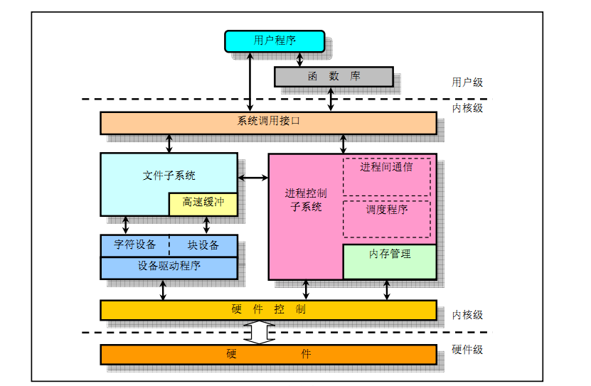
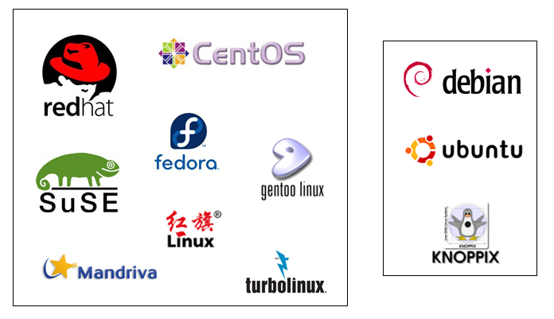
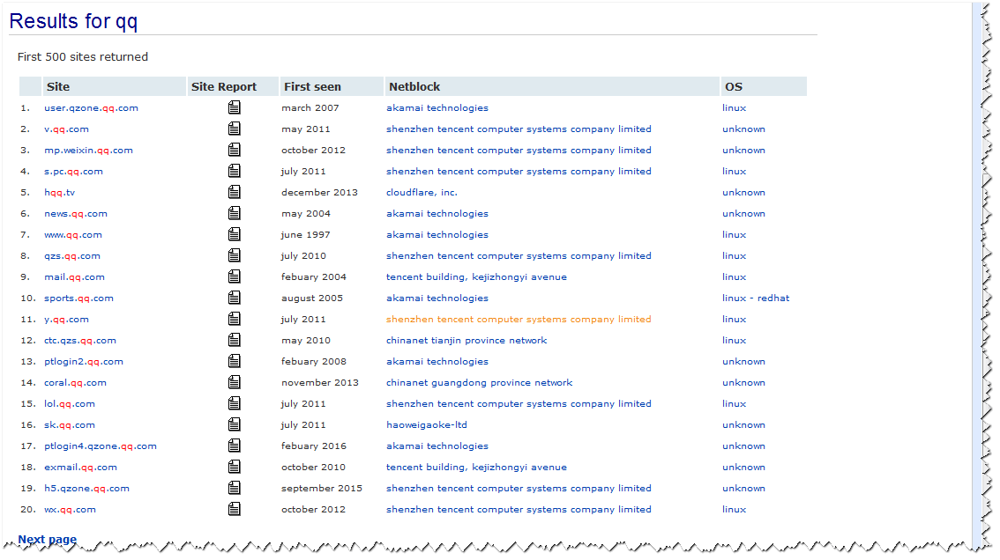

# Liunx系统简介 #

	1) 计算机
	2) 硬件组成
	3) 内核
	4) 操作系统
	5) 应用程序
	6) 什么是Linux
	7) 发展史
	8) Linux发行版
	9) Linux特色
	10) Linux用途

### 1) 计算机 ###
计算机是由一堆硬件所组成的，为了更有效地控制这些硬件资源，于是乎就有了操作系统的产生了。操作系统出了有效地控制这些硬件资源的分配，并提供计算机运行所需要的功能之外，为了要提供程序员更容易开发软件的环境，所以操作系统也会提供一整组系统调用接口来给软件程序员开发用。

### 2) 硬件组成 ###
计算机硬件主要分为三大部分：

1. 输入单元：包括键盘、鼠标、扫描仪、手写板、触摸屏幕等
2. 中央处理器(CPU)：含有算术逻辑、控制、记忆等单元
3. 输出单元：例如屏幕、打印机等

### 3) 内核 ###
操作系统内核是指大多数操作系统的核心部分。它由操作系统中用于管理存储器、文件、外设和系统资源的那些部分组成。操作系统内核通常运行进程，并提供进程间的通信。

《LINUX 和 WINDOWS 内核的区别》
<http://bbs.chinaunix.net/thread-1940245-1-1.html>

### 4) 操作系统 ###
操作系统(Operation System)主要用于管理与驱动硬件，因此必须要能够管理内存、管理设备、负责进程管理以及系统调用等。

操作系统重点仅在驱动与管理硬件，而要使用硬件时，就得需要通过应用软件或者shell的功能，来调用操作系统操纵硬件工作。因此，目前操作系统除了上述功能外，通常已经包含了日常工作所需要的应用软件在内了。

### 5) 应用程序 ###
应用程序是参考操作系统提供的开发接口所开发出来的软件，这些软件可以让用户操作，以达到某些计算机的功能利用。

### 6) 什么是Linux ###
Linux就是一套操作系统。Linux就是内核与系统调用接口那两层。内核与硬件的关系非常紧密。早期的Linux是针对386来开发的，由于Linux只是一套操作系统并不含有其他的应用程序，因此很多工程师在下载Linux内核并且实际安装以后，就只能看着计算机开始运行了！接下来这些高级工程师为了自己的需求，再在Linux上面安装他们所需要的软件。

Windows操作系统就是针对个人计算机Intel(x86)架构的硬件去设计的，所以它当然只能在x86的个人计算机上面运作，在不同的平台当然就无法运行了。也就是说每种操作系统都是在它专门的机器上面运行的。这点首先要了解。不过，Linux由于是开放源代码(Open Source)的操作系统，所以它的程序代码可以被修改成适合在各种机器上面运行的，也就是说，Linux具有“可移植性”，这个是很重要的概念。

Linux提供了一个完整的操作系统当中最底层的硬件控制与资源管理的完整架构，这个架构是沿袭Unix良好的传统而来的，所以相当稳定并且功能强大。此外，由于这个优良的架构可以在目前的个人计算机(x86系统)上面跑，所以很多软件开发者渐渐的将他们的工作重心转移到这个架构上面，所以Linux操作系统也有很多的应用软件。

虽然Linux仅是其内核与内核提供的工具，不过由于内核、内核工具与这些软件开发者提供的软件的整合，使得Linux成为一个更完整的、功能强大的操作系统。

<http://baike.baidu.com/item/linux>

### 7) 发展史 ###
#### 1965年： ####
贝尔实验室(Bell)、麻省理工学院(MIT)及通用电气公司(GE)共同发起了Multics的项目，Multics项目的目的是想让大型主机可以同时提供300台以上的终端机连接主机的目标。1969年前后，项目进度落后，资金也短缺，所以该项目虽然继续在研究，但贝尔实验室还是退出了该项目的研究工作。

#### 1969年： ####
当时，Ken Thompson（后被称为UNIX之父）已经有一个称为"星际旅行"的程序在GE－635的机器上跑，但是反应非常慢，正巧被他发现了一部被闲置的PDP－7（Digital的主机），Ken Thompson和Dernis Ritchie就将"星际旅行"的程序移植到PDP－7上。

Unix(尤尼斯)的诞生和Multics（Multiplexed Information and Computing System）是有一定渊源的。当时开发者Brian Kernighan开玩笑地戏称这个不完善系统MULTICS其实是:“UNiplexed Information and Computing System”，缩写为“UNICS”。于是这个项目被称为UnICS（UniplexedInformation andComputingSystem）。后来，大家取其谐音这个名字被改为UNIX。

Brian Wilson Kernighan是一位加拿大计算机科学家，在贝尔实验室，他与Unix的创造者Ken Thompson(发明的B语言)以及Dennis Ritchie(在B语言的基础上最终设计出了一种新的语言，他取了BCPL的第二个字母作为这种语言的名字，这就是C语言。)一起工作，同时它也是开发Unix的主要贡献者。他是 AWK 和 AMPL 编程语言的作者之一，AWK中的K说的就是Kernighan。同时，它也是《C程序设计语言》的作者之一，他与C语言的发明人Dennis Ritchie共同合作了这本书，K&R就是两人名字的缩写。Brian Kernighan现在是普林斯顿大学计算机学院的教授，同时，他也是本科学部的代表。

#### 1973年：UNIX正式诞生 ####
到了1973年的时候，Ken Thompson 与Dennis Ritchie感到用汇编语言做移植太过于头痛，他们想用高级语言来完成第三版，对于当时完全以汇编语言来开发程序的年代，他们的想法算是相当的疯狂。一开始他们想尝试用Fortran，可是失败了。后来他们用一个叫BCPL（Basic Combined Programming Language）的语言开发，他们整合了BCPL形成B语言，后来Dennis Ritchie觉得B语言还是不能满足要求，于是就改良了B语言，这就是今天的大名鼎鼎的C语言。于是，Ken Thompson 与Dennis Ritchie成功地用C语言重写了Unix的第三版内核。至此，Unix这个操作系统修改、移植相当便利，为Unix日后的普及打下了坚实的基础。而Unix和C完美地结合成为一个统一体，C与Unix很快成为世界的主导。

Unix的第一篇文章 “The UNIX Time Sharing System” 由Ken Thompson和Dennis Ritchie于1974年7月的 The Communications of the ACM发表。这是UNIX与外界的首次接触。结果引起了学术界的广泛兴趣并对其源码索取，所以，Unix第五版就以“仅用于教育目的”的协议，提供给各大学作为教学之用，成为当时操作系统课程中的范例教材。各大学公司开始通过Unix源码对Unix进行了各种各样的改进和扩展。于是，Unix开始广泛流行。

需要特别强调的是，由于UNIX是以较高级的C语言编写的，相对于汇编语言需要与硬件有密切的配合，高级的C语言与硬件的相关性就没有这么大了！所有这个改变也使得UNIX很容易被移植到不同的机器上。

#### 1977年： ####
重要的UNIX分支——BSD诞生

#### 1979年： ####
重要的System V架构及版权声明（商业化：UNIX开始收费）

#### 1984年####
**x86架构的Minix操作系统诞生**

关于1979年的版权声明中，影响最大的当然就是学校里教导UNIX内核源码相关学问的教授了。想想没有内核源码，那么如何教导学生认识UNIX呢?这问题对于AndrewTanenbaum(谭宁邦)教授来说，实在是很伤脑筋的。于是谭宁邦教授自己动手写了Minix这个UNIX Like的内核程序！在编写过程中，为了避免版权纠纷，谭宁邦教授完全不看UNIX内核源码，并且强调他的Minx必须能够与UNX兼容才行！谭宁邦在1984年开始编写内核程序，到了1986年终于完成，并且于次年出版Minix相关书籍，同时与BBS相结合。

这个Minix操作系统的开发者仅有谭宁邦教授，因为学术很忙，加上谭宁邦始终认为Minix主要用在教育上面，所以对于Minix是点到为止。Minix虽然很受欢迎，不过用户的需求/需要可能就没有办法上升到比较高的地方了。有趣的是，Minix版本并不是完全免费的，必须要通过购买磁盘/磁带才行，但是价格很便宜，随磁盘还会附上Minix的源码，这也意味着用户可以学习Minix的内核程序设计概念。

**GUN项目与FSF基金会成立**

C语言的**编译程序GCC**，用来操作操作系统的**基本接口bash**，这些都是在这期间开发，在1990年左右完成。

#### 1988年： ####
图形接口XFree86项目

#### 1991年： ####
芬兰赫尔辛基大学生Linus Torvalds，在BBS上面发了一个帖子。
宣称他以bash、gcc等工具编写了一个小小的内核程序，这个内核程序可以在Inter的386机器上面运行，让很多人很感兴趣，从此开始了linux不平凡的旅程。

内核：<https://www.kernel.org/pub/linux/kernel/>  Linux操作系统最底层的数据为“内核”。

简而言之：Linux成功的地方主要在于Minix(UNIX), GUN, Internet, POSIX及虚拟团队的产生。

### 8) Linux distributions(Linux发行版) 可完全安装的系统 ###
Linux distributions是“Linux Kernel + Free Software + Documentations(Tools) + 可完全安装的程序”所制成的一套完整的系统。

Red Hat, SuSE, Ubuntu, Fedora, Debian等。每个Linux distributions使用的内核都是 https://www.kernel.org/所发布的，而他们所选择的软件几乎都是目前很知名的软件，如网页服务器的Apache，电子邮件服务器的Postfix/sendmail，文件服务器的Samba等。

distributions 主要分为两大系统，一种是使用RPM方式安装软件的系统，包括Red Hat, SuSE, Fedora等；一种则是使用Debian的dpkg方式安装软件的系统，包括Debian, Ubuntu, B2D等。

- <http://www.centoscn.com/CentOS/2012/1226/96.html>
- <http://www.jb51.net/os/Ubuntu/56362.html>

**Linux内核的版本：**

1. 稳定版(偶数)：2.6.x
2. 开发中版本(奇数)：2.5.x

查看内核版本命令：uname -r

**到底选择商业版本还是团队版？**

答：如果是安装在个人计算机上面作为桌面计算机用的，建议使用团队版，包括：Fedora, Ubuntu, OpenSuSE等；如果是用在服务器上面的，建议使用商业版本。

用于个人或教学的服务器环境：号称完全兼容商业版Red Hat Enterprise Linux(RHEL)的CentOS。因为CentOS是抓RHEL的源码来重新写出来的一个Linux distribution，所以号称兼容于RHEL。这一版本的软件完全与RHEL相同，改版的幅度较小，适合于服务器系统的环境。

**版本选择：**CentOS-6.3-i386

### 9) Linux特色 ###
Linux具有硬件需求低、架构开放、系统稳定性及保密性功能够强、完全免费的优点。越来越多的程序工程师不断基于Linux开发新的软件，因此Linux就越来越流行。

#### 优点： ####
1. 系统稳定：继承了UNIX稳定并且有效率的特点，安装Liunx的主机连续运行一年以上而不宕机、不必关机是很平常的事情
2. 免费或少许费用：Linux是基于GUN授权下的产物，因此任何人皆可以自由取得Linux，至于一些“安装套件”的发行者，他们发型的安装光盘也仅需要些许费用即可获得。不同于UNIX需要负担庞大的版权费用，当然也不同于微软需要不断更新你的系统，并且缴纳大量费用。
3. 安全性、漏洞的快速修补：“没有绝对安全的主机”，不过Linux由于支持者众多，有相当多的热心团体或个人参与其中的开发，因此可以随时获取最新的安全信息，并随时更新，相对较安全。
4. 多任务、多用户：与Windows系统不同的，Linux主机上可以同时允许多人上线来工作，并且资源的分配较为公平，比起Windows的单人多任务系统要稳定的多。你可以在一部Linux主机上面规划处不同等级的用户，而且每个用户登录系统时的工作环境都可以不相同，此外，还可以允许不同的用户在同一个时间登录主机，以同时使用主机的资源。
5. 用户与用户组：在Linux的机器中，文件的属性可以分为可读、可写、可执行等参数来定义一个文件的适用性。此外这些属性还可以分为三个种类，分别是文件所有者、文件所属用户组、其他用户组与用户组者。这对于项目或者其他项目开发者都具有相当良好的系统保密性。
6. 相对比较不耗资源的系统：Linux只需要一部P III以上等级的计算机就可以安装并且使用顺畅，不过，如果你要假设的是属于大型的主机(服务于上百人以上的主机系统)，那么久需要比较好一点的机器了。
7. 适合需要小内核程序的嵌入式系统：由于Linux只要几百KB不到的程序代码就可以完整驱动整个计算机硬件并成为一个完整的操作系统，因此相当适合于目前家电或者是小电子用品的操作系统，即嵌入式系统。Linux真的是很适合例如手机、数码相机等操作系统。
8. 整合度佳且多样的图形用户界面(GUI)：常见的包括大家耳熟能详的KED以及GHOME。

...

普及率受到很大的限制，就是Linux需要使用“命令行”的终端机模式进行系统的管理。

#### 缺点： ####
1. 没有特定的厂商支持，但好在网络上也可以找到答案。
2. 游戏的支持度不够：游戏软件也是一个应用程序，所以它与操作系统的关系就相当密切了。目前很多游戏开发商并没有在Linux平台上开发大型游戏，这也导致Linux无法进入一般家庭。
3. 专业软件的支持度不够：比如一些专业的绘图软件公司所推出的专业软件并不支持Linux操作系统。

尽管如此，以上的缺点绝大部分并不是Linux本身的问题，倒是一些商业方面的考虑是比较大的困扰。Linux与其他操作系统一样，就是一个工具而已。

### 10) Linux应用 ###

查询网站的服务器信息：<https://www.netcraft.com/>

**帮助教程**

- <http://linux.vbird.org/>
- <http://www.apelearn.com/study_v2/index.html>
- <http://man.linuxde.net/>
- <https://linux.cn/>
