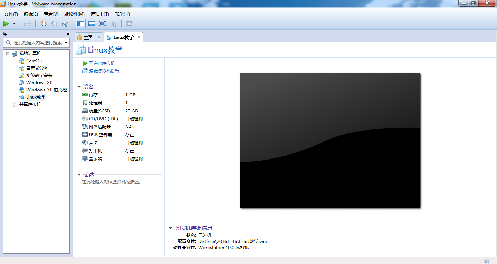
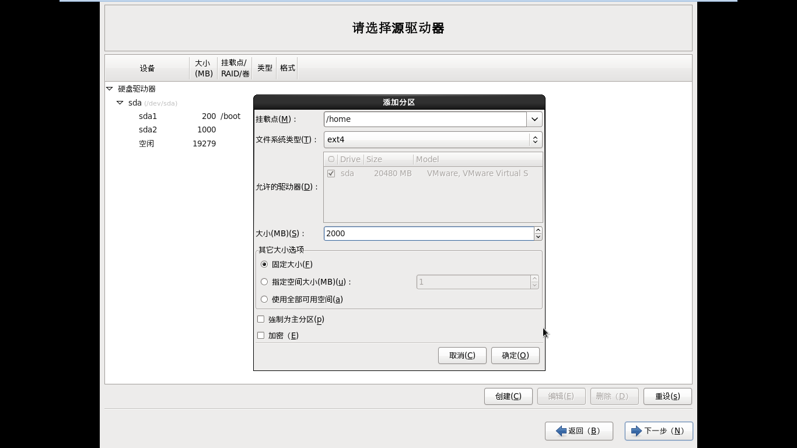
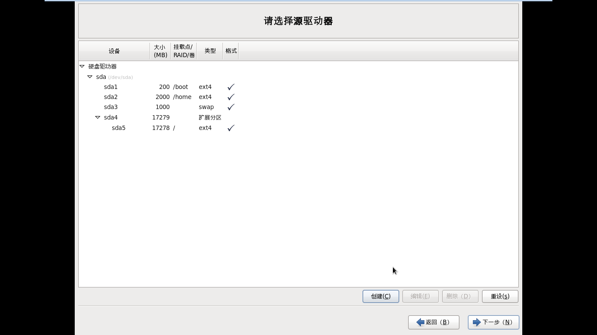

# Liunx系统安装 #

	安装Linux前需要了解的理论知识点：
		一、虚拟机的使用与VMware安装
		二、安装方式介绍
		三、Linux分区、格式化、挂载

	安装Linux操作系统的超详细图文教程：
		四、Linux安装过程

	Linux文件系统：
		五、文件类型
		六、文件结构

**SATA硬盘与IDE硬盘的区别：**

<table width="100%">
	<tr>
		<th>硬盘类型</th>
		<th>传输速度</th>
		<th>操作系统</th>
	</tr>
	<tr>
		<td>IDE硬盘</td>
		<td>100MB/秒</td>
		<td>-</td>
	</tr>
	<tr class="red">
		<td>SCSI/SATA硬盘(又叫：串口硬盘)</td>
		<td>SATA3.0速度可达到：600MB/秒</td>
		<td>CentOS 6</td>
	</tr>
</table>

**扩展：**如何区分SATA与PATA、IDE接口的硬盘及接口转接 <http://jingyan.baidu.com/article/f0062228d816a2fbd3f0c8d8.html>

**常见硬件设备在Linux中的文件名：**

<table width="100%">
	<tr>
		<th>设备</th>
		<th>设备在Linux中的文件名</th>
	</tr>
	<tr>
		<td>IDE硬盘</td>
		<td>/dev/hd[a-d]</td>
	</tr>
	<tr class="red">
		<td>SCSI/SATA/USB硬盘</td>
		<td>/dev/sd[a-p]</td>
	</tr>
	<tr>
		<td>U盘</td>
		<td>/dev/sd[a-p] (与STAT相同)</td>
	</tr>
	<tr>
		<td>打印机</td>
		<td>/dev/lp[0-2]...</td>
	</tr>
	<tr>
		<td>CD ROM/DVD ROM</td>
		<td>/dev/cdrom /dev/sr0</td>
	</tr>
</table>

## 一、虚拟机使用 ##

centos主要特点：

- 不需要分区或重新开机就能在同一台PC上使用两种以上的操作系统
- 本机系统可以与虚拟机系统网络通信
- 可以设定并且随时修改虚拟机操作系统的硬件环境

备注：VMware安装见教程

## 二、安装方式 ##

- 图形安装	：直接回车
- 字符安装：linux text  回车
- 耗费资源少，安装速度快。显卡不能识别

## 三、Linux分区、格式化、挂载 ##

一块新的硬盘，格式化写入文件系统，计算机存储数据，分区（最多4个主分区，扩展分区最多1个用来包含逻辑分区）

**1、linux分区表示**

**分区类型：**

- 主分区：最多只能分四个
- 扩展分区：扩展分区最多1个，扩展不能格式化，也不能写入数据。只能包含逻辑分区。扩展分区加主分区最多有4个。
- 逻辑分区：

**文件系统：**

- Windows：	fat16	fat32	ntfs	
- Linux：	 ext2	ext3	ext4
- Inode	i节点

**1) 注意事项**

- 注意：linux下所有内容都是文件，包括硬件
- linux严格区分大小写
- linux下不以扩展名区分文件类型，而是靠权限.但是有特列，如压缩文件，rpm软件包文件
- 所有的可存储设备，都必须挂载使用。包括硬盘

**2) Linux分区表示**

- /dev/hda1		(hd:IDE硬盘)
- /dev/sda1     (sd:SCSI，SATA硬盘	a：第一块硬盘 1：第一个分区)
- /dev/sdc5	    (第三块scsi硬盘的，第1个逻辑分区)

**3) 挂载过程**

**windows中：盘符**

- C:\
- D:\
- E:\

**Linux中：**

- 硬盘文件名----------指定挂载目录（盘符）		挂载
- /dev/sda1-----------/boot

**2、linux分区**

**1）必须分区**

- /				根分区必须单独分。	越大越好			C:分区
- swap分区			交换分区		2倍	不要大于2GB

**2）常用分区**

- /boot				启动分区		100MB		/dev/sda1	D:分区
- /home 													E:分区
- /www													    F:分区

**3、密码原则：**

复杂性，容易记忆性，时效性

linux管理员： root			

- vmzxdlxx
- vm2xd_LXX
- flzx_3QC

## 四、Linux安装过程 ##

<table width="100%">
	<tr>
		<th>Linux安装过程</th>
	</tr>
	<tr><td class="center"></td></tr>
	<tr><td class="center">创建一个虚拟机，取名CentOS</td></tr>
	<tr><td class="center"></td></tr>
	<tr><td class="center red">编辑虚拟机设置 > 设备：CD/DVD > 连接项设置操作系统的ISO镜像地址</td></tr>
	<tr><td class="center"></td></tr>
	<tr><td class="center">开启此虚拟机(开机)，选择第一项：Install or upgrade an existing system</td></tr>
	<tr><td class="center"></td></tr>
	<tr><td class="center">安装过程</td></tr>
	<tr><td class="center"></td></tr>
	<tr><td class="center red">选择“Skip”，忽略磁盘检测</td></tr>
	<tr><td class="center"></td></tr>
	<tr><td class="center">下一步</td></tr>
	<tr><td class="center"></td></tr>
	<tr><td class="center">选择“中文简体”</td></tr>
	<tr><td class="center"></td></tr>
	<tr><td class="center">默认“美国英语式”即可，下一步</td></tr>
	<tr><td class="center"></td></tr>
	<tr><td class="center">默认“基本存储设备”即可，下一步</td></tr>
	<tr><td class="center"></td></tr>
	<tr><td class="center">选择“是，忽略所有数据”即可，下一步</td></tr>
	<tr><td class="center"></td></tr>
	<tr><td class="center">默认“主机名”即可，下一步</td></tr>
	<tr><td class="center"></td></tr>
	<tr><td class="center">选择“上海时区”，下一步</td></tr>
	<tr><td class="center"></td></tr>
	<tr><td class="center">设置密码，新手建议设置123456，下一步</td></tr>
	<tr><td class="center"></td></tr>
	<tr><td class="center">弹出提示密码过于简单，选择“无论如何都使用”</td></tr>
	<tr><td class="center"></td></tr>
	<tr><td class="center red">注意：选择“创建自定义布局”，下一步(磁盘分区非常重要，新手参考教程中的分区设置即可)</td></tr>
	<tr><td class="center"></td></tr>
	<tr><td class="center">新建虚拟机时，我们给了20G空间大小，所以这里显示20473</td></tr>
	<tr><td class="center"></td></tr>
	<tr><td class="center">点击[创建]按钮，标准分区，点击[创建]按钮</td></tr>
	<tr><td class="center"></td></tr>
	<tr><td class="center">挂载点：/boot</td></tr>
	<tr><td class="center"></td></tr>
	<tr><td class="center">指定/boot的大小为固定大小，大小的值：200，选择确定即可</td></tr>
	<tr><td class="center"></td></tr>
	<tr><td class="center">选择文件系统类型为：swap</td></tr>
	<tr><td class="center"></td></tr>
	<tr><td class="center">指定大小为1000(固定大小)</td></tr>
	<tr><td class="center"></td></tr>
	<tr><td class="center">给/home挂载点，分配固定大小为2000。</td></tr>
	<tr><td class="center"></td></tr>
	<tr><td class="center">分区设置最后一步：选择挂载点/根目录，大小项选择：使用全部可用空间</td></tr>
	<tr><td class="center"></td></tr>
	<tr><td class="center">分区自定义设置完成，点击下一步</td></tr>
	<tr><td class="center"></td></tr>
	<tr><td class="center">弹出了“格式化警告”，选择[格式化]，下一步</td></tr>
	<tr><td class="center"></td></tr>
	<tr><td class="center">弹出了“将存储配置写入磁盘”，选择“将修改写入磁盘”，下一步</td></tr>
	<tr><td class="center"></td></tr>
	<tr><td class="center">默认即可，下一步</td></tr>
	<tr><td class="center"></td></tr>
	<tr><td class="center red">新手学习Linux，请选择“Basic Server”安装模式，下一步</td></tr>
	<tr><td class="center"></td></tr>
	<tr><td class="center">Linux正式安装过程</td></tr>
	<tr><td class="center"></td></tr>
	<tr><td class="center">安装过程约25分钟左右</td></tr>
	<tr><td class="center"></td></tr>
	<tr><td class="center">安装成功画面</td></tr>
	<tr><td class="center"></td></tr>
	<tr><td class="center">重新引导画面</td></tr>
	<tr><td class="center"></td></tr>
	<tr><td class="center">开机启动</td></tr>
	<tr><td class="center"></td></tr>
	<tr><td class="center">启动成功</td></tr>
	<tr><td class="center"></td></tr>
	<tr><td class="center">输入用户名，超级管理员用户名：root和设置的管理员密码，登录</td></tr>
	<tr><td class="center"></td></tr>
	<tr><td class="center">执行命令：ls可以列出当前目录下文件</td></tr>
	<tr><td class="center"></td></tr>
	<tr><td class="center red">设置快照，快照可以用于系统恢复，十分强大！没有玩坏过Linux系统10遍以上，肯定不是高手！</td></tr>
	<tr><td class="center"></td></tr>
	<tr><td class="center">保存快照中，取名“安装初始化”</td></tr>
	<tr><td class="center"></td></tr>
	<tr><td class="center red">如图：想要恢复到快照，选中要恢复的快照，点击转到即可(这里强烈建议新手新安装系统后，就设置一下快照)</td></tr>
	<tr><td class="center"></td></tr>
	<tr><td class="center">如果需要关闭虚拟机，选择挂起即可(直接关闭虚拟机等同于关电源，可能导致Linux系统文件破损)</td></tr>
</table>

## 五、文件类型 ##
<table width="100%">
	<caption>Linux文件类型</caption>
	<tr>
		<th>文件类型</th>
		<th>说明</th>
	</tr>
	<tr>
		<td>普通文件（regular file）</td>
		<td>就是一般存取的文件，由ls -al显示出来的属性中，第一个属性为 [-]，例如 [-rwxrwxrwx]。</td>
	</tr>
	<tr>
		<td>目录文件（directory）</td>
		<td>就是目录，第一个属性为 [d]，例如 [drwxrwxrwx]。</td>
	</tr>
	<tr>
		<td>连接文件（link）</td>
		<td>类似Windows下面的快捷方式。第一个属性为 [l]，例如 [lrwxrwxrwx]。</td>
	</tr>
	<tr>
		<td>设备与设备文件（device）</td>
		<td>与系统外设及存储等相关的一些文件，通常都集中在 /dev目录。</td>
	</tr>
	<tr>
		<td>套接字（sockets）</td>
		<td>这类文件通常用在网络数据连接。可以启动一个程序来监听客户端的要求，客户端就可以通过套接字来进行数据通信。第一个属性为 [s]，最常在 /var/run目录中看到这种文件类型。</td>
	</tr>
	<tr>
		<td>管道（FIFO,pipe）</td>
		<td>FIFO也是一种特殊的文件类型，它主要的目的是，解决多个程序同时存取一个文件所造成的错误。FIFO是first-in-first-out（先进先出）的缩写。第一个属性为 [p]。</td>
	</tr>
</table>

## 六、文件结构 ##
<table width="100%">
	<caption>Linux文件结构</caption>
	<tr>
		<th>目录</th>
		<th>说明</th>
	</tr>
	<tr>
		<td>/</td>
		<td>根目录，所有的目录、文件、设备都在/之下，/就是Linux文件系统的组织者，也是最上级的领导者。</td>
	</tr>
	<tr>
		<td>/bin</td>
		<td>bin 就是二进制（binary）英文缩写。在一般的系统当中，都可以在这个目录下找到linux常用的命令。系统所需要的那些命令位于此目录。</td>
	</tr>
	<tr>
		<td>/boot</td>
		<td>Linux的内核及引导系统程序所需要的文件目录，比如 vmlinuz initrd.img 文件都位于这个目录中。在一般情况下，GRUB或LILO系统引导管理器也位于这个目录。</td>
	</tr>
	<tr>
		<td>/cdrom</td>
		<td>这个目录在刚刚安装系统的时候是空的。可以将光驱文件系统挂在这个目录下。例如：mount /dev/cdrom /cdrom</td>
	</tr>
	<tr>
		<td>/dev</td>
		<td>dev 是设备（device)的英文缩写。这个目录对所有的用户都十分重要。因为在这个目录中包含了所有linux系统中使用的外部设备。但是这里并不是放的外部设备的驱动程序。这一点和常用的windows, dos操作系统不一样。它实际上是一个访问这些外部设备的端口。可以非常方便地去访问这些外部设备，和访问一个文件，一个目录没有任何区别。</td>
	</tr>
	<tr>
		<td>/etc</td>
		<td>etc这个目录是linux系统中最重要的目录之一。在这个目录下存放了系统管理时要用到的各种配置文件和子目录。要用到的网络配置文件，文件系统，x系统配置文件，设备配置信息，设置用户信息等都在这个目录下。</td>
	</tr>
	<tr>
		<td>/home</td>
		<td>如果建立一个用户，用户名是"xx",那么在/home目录下就有一个对应的/home/xx路径，用来存放用户的主目录(用户家目录)。</td>
	</tr>
	<tr>
		<td>/lib</td>
		<td>lib是库（library）英文缩写。这个目录是用来存放系统动态连接共享库的。几乎所有的应用程序都会用到这个目录下的共享库。因此，千万不要轻易对这个目录进行什么操作，一旦发生问题，系统就不能工作了。</td>
	</tr>
	<tr>
		<td>/lost+found</td>
		<td>在ext2或ext3文件系统中，当系统意外崩溃或机器意外关机，而产生一些文件碎片放在这里。当系统启动的过程中fsck工具会检查这里，并修复已经损坏的文件系统。有时系统发生问题，有很多的文件被移到这个目录中，可能会用手工的方式来修复，或移到文件到原来的位置上。</td>
	</tr>
	<tr>
		<td>/mnt</td>
		<td>这个目录一般是用于存放挂载储存设备的挂载目录的，比如有cdrom等目录。可以参看/etc/fstab的定义。</td>
	</tr>
	<tr>
		<td>/media</td>
		<td>有些linux的发行版使用这个目录来挂载那些usb接口的移动硬盘（包括U盘）、CD/DVD驱动器等等。</td>
	</tr>
	<tr>
		<td>/opt</td>
		<td>这里主要存放那些可选的程序。</td>
	</tr>
	<tr>
		<td>/proc</td>
		<td>可以在这个目录下获取系统信息。这些信息是在内存中，由系统自己产生的。</td>
	</tr>
	<tr>
		<td>/root</td>
		<td>Linux超级权限用户root的家目录。</td>
	</tr>
	<tr>
		<td>/sbin</td>
		<td>这个目录是用来存放系统管理员的系统管理程序。大多是涉及系统管理的命令的存放，是超级权限用户root的可执行命令存放地，普通用户无权限执行这个目录下的命令，这个目录和/usr/sbin; /usr/X11R6/sbin或/usr/local/sbin目录是相似的，凡是目录sbin中包含的都是root权限才能执行的。</td>
	</tr>
	<tr>
		<td>/selinux</td>
		<td>对SElinux的一些配置文件目录，SElinux可以让linux更加安全。</td>
	</tr>
	<tr>
		<td>/srv</td>
		<td>服务启动后，所需访问的数据目录，举个例子来说，www服务启动读取的网页数据就可以放在/srv/www中</td>
	</tr>
	<tr>
		<td>/tmp</td>
		<td>临时文件目录，用来存放不同程序执行时产生的临时文件。有时用户运行程序的时候，会产生临时文件。/tmp就用来存放临时文件的。/var/tmp目录和这个目录相似。</td>
	</tr>
	<tr>
		<td>/usr</td>
		<td>这是linux系统中占用硬盘空间最大的目录。用户的很多应用程序和文件都存放在这个目录下。在这个目录下，可以找到那些不适合放在/bin或/etc目录下的额外的工具</td>
	</tr>
	<tr>
		<td>/usr/local</td>
		<td>这里主要存放那些手动安装的软件，即不是通过“新立得”或apt-get安装的软件。它和/usr目录具有相类似的目录结构。让软件包管理器来管理/usr目录，而把自定义的脚本（scripts)放到/usr/local目录下面。</td>
	</tr>
	<tr>
		<td>/usr/share</td>
		<td>系统共用的东西存放地，比如 /usr/share/fonts 是字体目录，/usr/share/doc和/usr/share/man帮助文件。</td>
	</tr>
	<tr>
		<td>/var</td>
		<td>这个目录的内容是经常变动的，看名字就知道，可以理解为vary的缩写，/var下有/var/log 这是用来存放系统日志的目录。/var/ www目录是定义Apache服务器站点存放目录；/var/lib 用来存放一些库文件，比如MySQL的，以及MySQL数据库的的存放地。</td>
	</tr>
</table>

## 作业： ##

1. 安装Linux（centos、Linux系统）
2. 课堂练习
3. 预习-Linux常用命令