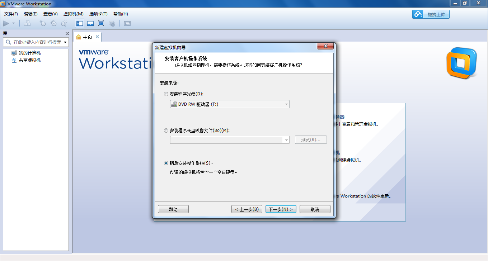
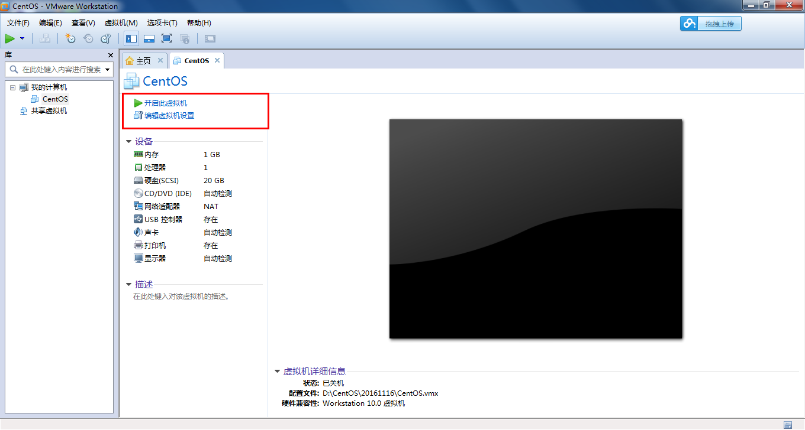

# VMware的安装 #

- 作者：王波
- 2016/11/16
****
	一、VMware的安装过程
	二、VMware的常用操作

## 一、VMware的安装过程 ##
版本：VMware-10.0.2

<table width="100%">
	<tr>
		<th>VMware的安装过程</th>
	</tr>
	<tr>
		<td class='center'></td>
	</tr>
	<tr>
		<td class="center">01、安装界面</td>
	</tr>
	<tr>
		<td class='center'></td>
	</tr>
	<tr>
		<td class="center">02、默认【下一步】</td>
	</tr>
	<tr>
		<td class='center'></td>
	</tr>
	<tr>
		<td class="center">03、选择“我接受”，【下一步】</td>
	</tr>
	<tr>
		<td class='center'></td>
	</tr>
	<tr>
		<td class="center red">04、安装类型选择“典型”，【下一步】</td>
	</tr>
	<tr>
		<td class='center'></td>
	</tr>
	<tr>
		<td class="center">05、更改安装目录，【下一步】</td>
	</tr>
	<tr>
		<td class='center'></td>
	</tr>
	<tr>
		<td class="center">06、不建议选择C盘，建议安装在D盘：Program Files下，【下一步】</td>
	</tr>
	<tr>
		<td class='center'></td>
	</tr>
	<tr>
		<td class="center">07、不需要启动更新，【下一步】</td>
	</tr>
	<tr>
		<td class='center'></td>
	</tr>
	<tr>
		<td class="center">08、不需要帮助改善，【下一步】</td>
	</tr>
	<tr>
		<td class='center'></td>
	</tr>
	<tr>
		<td class="center">09、默认【下一步】</td>
	</tr>
	<tr>
		<td class='center'></td>
	</tr>
	<tr>
		<td class="center">10、选择【继续】</td>
	</tr>
	<tr>
		<td class='center'></td>
	</tr>
	<tr>
		<td class="center red">11、安装过程，约3~5秒</td>
	</tr>
	<tr>
		<td class='center'></td>
	</tr>
	<tr>
		<td class="center">12、输入密钥，选择【输入】</td>
	</tr>
	<tr>
		<td class='center'></td>
	</tr>
	<tr>
		<td class="center">13、完成安装，选择【完成】</td>
	</tr>
	<tr>
		<td class='center'></td>
	</tr>
	<tr>
		<td class="center">14、成功安装：在电脑桌面，出现VMware虚拟机图标，双击运行VMware虚拟机</td>
	</tr>
</table>

****

## 二、VMware的常用操作 ##

<table>
	<tr>
		<td class='center'></td>
	</tr>
	<tr>
		<td class="center">01、运行VMware的界面，选择【创建新的虚拟机】</td>
	</tr>
	<tr>
		<td class='center'></td>
	</tr>
	<tr>
		<td class="center">02、选择【典型】，【下一步】</td>
	</tr>
	<tr>
		<td class='center'></td>
	</tr>
	<tr>
		<td class="center red">03、选择【稍后安装操作系统】，【下一步】</td>
	</tr>
	<tr>
		<td class='center'></td>
	</tr>
	<tr>
		<td class="center red">04、学习Linux请选择，选择客户机操作系统为Linux，版本为“CentOS”。(推荐使用32位)。【下一步】</td>
	</tr>
	<tr>
		<td class='center'></td>
	</tr>
	<tr>
		<td class="center red">05、给虚拟机去名称，这里我们就叫“CentOS”，你也可以任意取名。然后选择系统安装的【位置】(除C盘以外的其他盘符)，这里我们选择安装在D盘下的：D:/CentOS/201611。</td>
	</tr>
	<tr>
		<td class='center'></td>
	</tr>
	<tr>
		<td class="center">06、指定磁盘大小，Linux系统默认选择20GB即可！注意：首先检查所安装的磁盘空间大小是否充足，其次安装完成后，虚拟机比较只能，安装完成后不会立马占据20GB的磁盘空间，实际占用多少久占据多少空间。</td>
	</tr>
	<tr>
		<td class='center'></td>
	</tr>
	<tr>
		<td class="center">07、创建虚拟机完成：选择【完成】即可</td>
	</tr>
	<tr>
		<td class='center'></td>
	</tr>
	<tr>
		<td class="center">08、安装虚拟机成功的显示界面。你可以选择“编辑虚拟机设置”再进行设置，如内存大小、网络连接、指定镜像文件等。或者选择“开启此虚拟机”，即可运行你成功安装的操作系统，在虚拟机中使用操作系统是完全模拟了在PC机上安装的操作系统。是不是觉得虚拟机非常强大啊，是学习实验的好工具，也非常简单吧？  同时，你也可以在一台电脑上，同时安装多个虚拟机，比如说安装一个XP系统、多个版本的Linux系统、不同用途的Linux系统等等。  这是我们开始Linux学习之旅的开始哦！小伙伴们，请期待我们后续的Linux课程吧！</td>
	</tr>
	<tr>
		<td class='center'></td>
	</tr>
	<tr>
		<td class="center">09、如图：虚拟机安装成功后，在磁盘上生成一些文件。</td>
	</tr>
	<tr>
		<td class='center'></td>
	</tr>
	<tr>
		<td class="center">10、虚拟机模拟了真实的PC机，选择【电源】，包含：启动、关闭、挂起、重新启动的选项。</td>
	</tr>
	<tr>
		<td class='center'></td>
	</tr>
	<tr>
		<td class="center red">11、如图：虚拟机设置 → 硬件选项 → CD，模拟了光驱。</td>
	</tr>
	<tr>
		<td class='center'></td>
	</tr>
	<tr>
		<td class="center red">12、如图：虚拟机设置 → 硬件选项 → 网络适配器 </td>
	</tr>
	<tr>
		<td class='center'></td>
	</tr>
	<tr>
		<td class="center">13、虚拟机拍照功能，等同于系统还原，非常方便</td>
	</tr>
	<tr>
		<td class='center'></td>
	</tr>
	<tr>
		<td class="center">14、点击拍照设置，填写快照名称，点击【拍摄快照】即可</td>
	</tr>
	<tr>
		<td class='center'></td>
	</tr>
	<tr>
		<td class="center">15、通过快照管理器，我们可以还原到保存的任意一个快照保存时的系统状态。 建议：每次安装好系统后，习惯保存一个“初始化安装”快照，这样即使系统被玩坏了，可以通过快照进行恢复。同样，你还可以通过克隆的方式，创建新的虚拟机，等同于复制，在后面会提到这个功能。</td>
	</tr>
	<tr>
		<td class='center'></td>
	</tr>
	<tr>
		<td class="center">16、启动虚拟机画面</td>
	</tr>
	<tr>
		<td class='center'></td>
	</tr>
	<tr>
		<td class="center">17、管理 → 克隆，可以克隆一个虚拟机。(克隆必须在系统关闭状态下)</td>
	</tr>
	<tr>
		<td class='center'></td>
	</tr>
	<tr>
		<td class="center">18、全屏的快捷键：Ctrl + Alt + Enter</td>
	</tr>
</table>

下一步，使用虚拟机安装一个Linux操作系统
