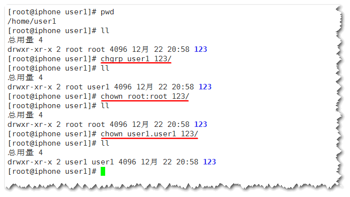
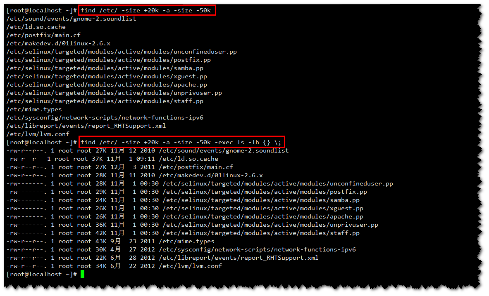

# Linux常用命令 #
2016/11/14 0:51:34 
作者：Wang.Bo

	一、文件操作命令
	二、文件和目录都能操作的命令
	三、权限管理
	四、帮助命令
	五、查找命令
	六、压缩和解压缩
	七、关闭和重启命令
	八、挂载命令
	九、网络命令

## 一、文件操作命令 ##

### 1）创建空文件或修改文件时间 ###
命令名称：touch

<table width="100%">
	<tr>
		<th>touch 文件名</th>
	</tr>
	<tr>
		<td>命令所在路径：/bin/touch</td>
	</tr>

</table>

### 2）删除 ###
命令名称：rm (英文：remove)

<table width="100%">
	<tr>
		<th>rm -rf 文件名</th>
	</tr>
	<tr>
		<td>选项： 
		[-r] 删除目录 
		[-f] 强制</td>
	</tr>
	<tr>
		<td>命令所在路径：/bin/rm</td>
	</tr>
</table>

### 3）cat 文件名 ###
命令名称：cat 查看文件内容，从头到尾

<table width="100%">
	<tr>
		<th>cat 文件名</th>
	</tr>
	<tr>
		<td>
			选项： [-n] 列出行号
		</td>
	</tr>
	<tr>
		<td>命令所在路径：/bin/cat</td>
	</tr>
</table>

### 4）more 文件名 ###
命令名称：more 分屏显示文件内容

<table width="100%">
	<tr>
		<th>more 文件名</th>
	</tr>
	<tr>
		<td>操作键： 【空格】 向下翻页 【b】 向上翻页 【q】 退出</td>
	</tr>
	<tr>
		<td>命令所在路径：/bin/more</td>
	</tr>
</table>

### 5） 显示文件头 ###
命令名称：head 显示文件头

<table width="100%">
	<tr>
		<th>head 文件名</th>
	</tr>
	<tr>
		<td>选项： [-n] 行数，指定显示文件头几行</td>
	</tr>
	<tr>
		<td>举例： 
		head -n 20 文件名 
		head -20 文件名</td>
	</tr>
	<tr>
		<td>命令所在路径：/usr/bin/head</td>
	</tr>
</table>

### 6）常用快捷键 ###

<table width="100%">
	<tr>
		<th>常用快捷键</th>
	</tr>
	<tr>
		<td class="red">【ctrl + c】 强制终止当前命令</td>
	</tr>
	<tr>
		<td class="red">【ctrl + l】 清屏</td>
	</tr>
	<tr>
		<td>【ctrl + a】 光标移到命令行首</td>
	</tr>
	<tr>
		<td>【ctrl + e】 光标移到命令行尾</td>
	</tr>
	<tr>
		<td>【ctrl + u】 从光标所在位置删除到行首</td>
	</tr>
	<tr>
		<td>【ctrl + z】 把命令放入后台</td>
	</tr>
	<tr>
		<td>【ctrl + r】 在历史命令中搜索</td>
	</tr>
</table>

### 7）	链接文件 ###
命令名称：ln （英文：link）

<table width="100%">
	<tr>
		<th>ln [源文件] [目标文件]</th>
	</tr>
	<tr>
		<td>选项： [-s] 创建软连接</td>
	</tr>
	<tr>
		<td>命令所在路径：/bin/ln</td>
	</tr>
</table>

**软链接特征：**

- 新建的链接，占用不同的硬盘位置
- 修改一个文件，两者都改变
- 删除源文件，软链接打不开

**注意：**文件名都必须写绝对路径

## 二、文件和目录都能操作的命令 ##

### 1）删除文件或目录 ###
命令名称：rm

<table width="100%">
	<tr>
		<th>rm -rf [文件或目录]</th>
	</tr>
	<tr>
		<td>选项： [-r] 删除目录 [-f] 强制删除</td>
	</tr>
</table>

### 2）复制 ###
命令名称：cp (英文：copy)

<table width="100%">
	<tr>
		<th>cp [源文件] [目标位置]</th>
	</tr>
	<tr>
		<td>选项： -r 复制目录 
-p 连带文件属性复制 
-d 若源文件是链接文件，则复制链接属性 
-a 相当于 -pdr</td>
	</tr>
	<tr>
		<td>举例： cp aa /tmp/  (原名复制) cp aa /tmp/bb  (改名复制)</td>
	</tr>
	<tr>
		<td>命令所在路径：/bin/cp</td>
	</tr>
</table>

### 3）剪切或改名 ###
命令名称：mv (英文：move)

<table width="100%">
	<tr>
		<th>mv [源文件|目录] [目标位置]</th>
	</tr>
	<tr>
		<td>命令所在路径：/bin/mv</td>
	</tr>
	<tr>
		<td>举例： mv /root/aa /tmp/ mv aa bb</td>
	</tr>
</table>

**注意：** 源文件和目标目录在同一个目录是改名，不在同一个目录则是剪切。

## 三、权限管理 ##

### 1) Linux文件权限的设定 ###

<table width="100%">
	<tr>
		<th>chmod [选项] 模式 文件名</th>
	</tr>
	<tr>
		<td>
			选项： 
			[-R] 递归
		</td>
	</tr>
	<tr>
		<td>
			模式： 
			[ugoa] [+-=] [rwx] 
			[mode=421]
		</td>
	</tr>
	<tr>
		<td>
			举例： 
			chmod u+x demo.txt 
			chmod g+w,o+w demo.txt 
			chmod a=rwx demo.txt
		</td>
	</tr>
</table>

<http://man.linuxde.net/chmod>

#### 权限位的数字表示 ####
<table width="100%">
	<caption>权限位的数字表示</caption>
	<tr>
		<th width="33%">r</th>
		<th width="33%">w</th>
		<th>x</th>
	</tr>
	<tr>
		<td align="center">4</td>
		<td align="center">2</td>
		<td align="center">1</td>
	</tr>
	<tr>
		<td colspan="3" align="center">
			举例： 
			 
		</td>
	</tr>
	<tr>
		<td>rwxr-xr-x</td>
		<td colspan="2">755</td>
	</tr>
	<tr>
		<td>rw-r--r--</td>
		<td colspan="2">644</td>
	</tr>
</table>

### 2) Linux文件权限的作用 ###
<table width="100%">
	<caption>Linux文件权限的作用</caption>
	<tr>
		<th width="10%"></th>
		<th width="45%">权限对文件的作用</th>
		<th width="45%">权限对目录的作用</th>
	</tr>
	<tr>
		<th>r</th>
		<td>读取文件内容 (cat, more, head, tail)</td>
		<td>可以查询目录下的文件名 (ls)</td>
	</tr>
	<tr>
		<th>w</th>
		<td>编辑、新增、修改文件内容 (vim, echo) 不包含删除文件</td>
		<td>具有修改目录结构的权限，如新建文件和目录，删除此目录下的文件和目录，重命名此目录下文件和目录，剪切 (touch, rm, mv, cp)</td>
	</tr>
	<tr>
		<th>x</th>
		<td>可执行</td>
		<td>可以进入目录 (cd)</td>
	</tr>
</table>

> 备注：目录所能赋的最高权限是w，一般可以设置为0，5(r-x)，7(rwx)，设置为其他如4(r--)，目录都无法进入，则没有意义。

### 3) Linux中权限对目录的作用及案例演示 ###

`whoami` 查看当前登录用户

<table width="100%">
	<tr>
		<th>案例演示</th>
	</tr>
	<tr>
		<td>
			
第一步：创建一个新用户 user1

			
			
第二步：进入用户的家目录下，创建文件和目录，并设置权限为0

			
			
第三步：使用新用户登录后，访问上面创建的文件和目录，看权限的效果。

			
		</td>
	</tr>
</table>

### 4) Linux中其他权限命令 ###
#### 2.4.1 修改文件的所有者 ####

<table width="100%">
	<tr>
		<th>chown 用户名 文件名</th>
	</tr>
	<tr>
		<td>
			
# 修改文件的所有者

		</td>
	</tr>
	<tr>
		<td>
			举例： 
			chown user1 ceshi 
			
		</td>
	</tr>
</table>

#### 2.4.2 修改文件的所属组 ####

<table width="100%">
	<tr>
		<th>chgrp 组名 文件名</th>
	</tr>
	<tr>
		<td>
# 修改文件的所属组
</td>
	</tr>
	<tr>
		<td>
			举例： 
			chgrp user1 ceshi 或 chown root root ceshi 
			
		</td>
	</tr>
</table>

## 四、帮助命令 ##
### 1）查看命令的帮助 ###
命令名称：man (英文：manual。获取命令的帮助)

<table width="100%">
	<tr>
		<th>man [选项] 命令</th>
	</tr>
	<tr>
		<td>选项： 
		[-f] 查看命令拥有哪个级别的帮助。(相当于：whatis 命令)
		</td>
	</tr>
	<tr>
		<td>命令所在路径：/usr/bin/man</td>
	</tr>
</table>

效果图：

### 2）查看命令的常见选项 ###
命令名称：--help (获取命令选项帮助)

<table width="100%">
	<tr>
		<th>命令 --help</th>
	</tr>
	<tr>
		<td>举例： ls --help 注意：可以结合管道符使用如：ls --help | more</td>
	</tr>
</table>

效果图：

### 3）详细命令帮助 ###
命令名称：info

<table width="100%">
	<tr>
		<th>info 命令</th>
	</tr>
	<tr>
		<td>选项： 
		[-回车] 进入子帮助页面(带*号标记) 
		[-u] 进入上层帮助 
		[-n] 进入下一个帮助小节 
		[-p] 进入上一个帮助小节 
		[-q] 退出
		</td>
	</tr>
</table>

效果图：

## 五、查找命令 ##
### 1）locate 文件名 ###
在后台数据库中按文件名搜索，好处是：搜索速度更快。缺点是：新创建的文件需要等到更新数据库后才能搜索(一般需要24小时更新)，但也可以使用命令：updatedb，进行更新数据库。

**注意：**如图可以查看配置文件：/etc/updatedb.conf，开启搜索限制等。

### 2）查找命令名 ###
<1>、命令名称：whereis (查找命令的命令，同时看到帮助文档位置)

<table width="100%">
	<tr>
		<th>whereis 命令名</th>
	</tr>
	<tr>
		<td>选项： [-b] 只查看可执行文件 [-m] 只看帮助文件</td>
	</tr>
	<tr>
		<td>命令所在路径：/usr/bin/whereis</td>
	</tr>
</table>

**备注：**
PATH环境变量：定义了系统搜索命令的路径。可以使用 echo $PATH，查看命令路径。

<2>、命令名称：which (查看命令路径，不显示帮助文档位置，但是可以显示别名)

<table width="100%">
	<tr>
		<th>which 命令名</th>
	</tr>
	<tr>
		<td>命令所在路径：/usr/bin/which</td>
	</tr>
</table>

### 3）搜索文件 ###
<table width="100%">
	<tr>
		<th>find [搜索范围] [搜索条件] [搜索文件名]</th>
	</tr>
	<tr>
		<td>选项： 
		1、按文件名搜索： 
		[-name] 按文件名称 
		[-iname] 按文件名称，区分大小写 
		 
		2、按文件所有者搜索： 
		[-user] 按照属主用户名查找文件 
		[-group] 按照属组组名查找文件 
		[-nouser] 找没有属主的文件 
		 
		3、按文件的属性大小、i节点、权限、文件类型等： 
		[-size] 按文件大小 
		[-inum] 按i节点 
		[-type] 按文件类型 
		[-perm] 按文件权限 
		 
		4、按文件的时间： 
		[-atime] 按文件访问时间 
		[-ctime] 改变文件属性 
		[-mtime] 修改文件内容 
		</td>
	</tr>
	<tr>
		<td>实例： 
		find / -name install.log (find是在系统当中搜索符合条件的文件资源名。需要匹配，可以结合通配符完全匹配。) 
		</td>
	</tr>
	<tr>
		<td>命令所在路径：/usr/bin/find</td>
	</tr>
</table>

**补充知识点：通配符**
可以结合查找的文件名使用。

<table width="100%">
	<tr>
		<th colspan="2">通配符</th>
	</tr>
	<tr>
		<td>*</td>
		<td>匹配任意内容</td>
	</tr>
	<tr>
		<td>?</td>
		<td>匹配任意一个字符</td>
	</tr>
	<tr>
		<td>[]</td>
		<td>匹配任意一个中括号内的字符</td>
	</tr>
</table>

**逻辑运算符**

<table width="100%">
	<tr>
		<th colspan="2">逻辑运算符</th>
	</tr>
	<tr>
		<td>-a</td>
		<td>(and) 逻辑与，两个条件同时都满足</td>
	</tr>
	<tr>
		<td>-o</td>
		<td>(or) 逻辑或，两个条件满足一个即可。</td>
	</tr>
</table>

**<1>、实例显示：**

**<2>、按文件大小查找：**

**备注：**

- [-25k] 表示文件大小小于25K
- [25k] 表示文件大小等于25K
- [+25k] 表示文件大小大于25K

**<3>、文件名使用通配符，进行完全匹配：**

**<4>、按i节点查找：**

**<5>、使用逻辑运算符，按文件大小查找**

查找/etc下，大于20KB并且小于50KB的文件。可以使用-exec命令，注意必须以“{} \;”结尾，对搜索结果执行操作。

备注：`/proc`, `/sys`, `/mnt/cdrom/`除了这三个目录

### 4）字符串搜索 ###
命令名称：grep (查找符合条件的字串行)

<table width="100%">
	<tr>
		<th>grep [选项] 字符串 文件名</th>
	</tr>
	<tr>
		<td>选项： 
		[-i] 忽略大小写
		[-v] 反向选择，排除指定字符串
		</td>
	</tr>
	<tr>
		<td>举例： 
		grep -i root /etc/passwd</td>
	</tr>
	<tr>
		<td>命令所在路径：/bin/grep</td>
	</tr>
</table>

###小结：find与grep命令的区别 ###

- find:	在系统当中搜索符合条件的文件名，如果需要匹配，使用通配符匹配。通配符是完全匹配。
- grep：在文件当中搜索符合条件的字符串，如果需要匹配，使用正则表达式匹配，正则表达式是包含匹配

## 六、压缩和解压缩 ##
### 1) Linux常用压缩格式 ###
<table width="100%">
	<tr>
		<th colspan="2">Linux常用压缩格式</th>
	</tr>
	<tr>
		<td>常见压缩格式</td>
		<td>.zip; .gz, .bz2</td>
	</tr>
	<tr>
		<td>常见的压缩和打包格式</td>
		<td>.tar.gz 和 .tar.bz2</td>
	</tr>
</table>

### 2) .zip格式压缩 ###
<table width="100%">
	<tr>
		<th>zip格式压缩</th>
	</tr>
	<tr>
		<td>实例： 
		zip -r 压缩文件名 源文件 
		unzip 压缩文件
		</td>
	</tr>
</table>

### 3) .gz格式压缩 ###
<table width="100%">
	<tr>
		<th>.gzip格式压缩</th>
	</tr>
	<tr>
		<td>实例：压缩 
		gzip 源文件 (压缩为.gz格式的压缩文件，源文件会消失。) 
		gzip -c 源文件 > 压缩文件 (使用输出重定向，压缩文件为.gz格式，源文件会保留。) 
		gzip -r 目录 (压缩目录下的所有的子文件，但是不能压缩目录。)
		</td>
	</tr>
	<tr>
		<td>实例：解压 
		gzip -d 压缩文件 
		gunzip 压缩文件</td>
	</tr>
</table>

### 4) .bz2格式压缩 ###

<table width="100%">
	<tr>
		<th>.bz2格式压缩</th>
	</tr>
	<tr>
		<td>实例：压缩 
		bzip2 源文件 (压缩为.bz2格式，不保留源文件) 
		bzip2 -k 源文件 (压缩为.bz2格式，但保留源文件) 
		注意：bzip2格式不能压缩目录。
		</td>
	</tr>
	<tr>
		<td>实例：解压 
		bzip2 -d 压缩文件 (解压缩，-k保留压缩文件) 
		bunzip 压缩文件 (解压缩，-k保留压缩文件)
		</td>
	</tr>
</table>

### 5) 打包命令 ###
命令名称：tar

<table width="100%">
	<tr>
		<th>tar [选项] 打包文件名 源文件</th>
	</tr>
	<tr>
		<td>选项： 
		[-c] 打包 
		[-v] 显示过程 
		[-f] 指定打包后的文件名
		</td>
	</tr>
	<tr>
		<td>实例： 
		tar -cvf 打包文件名 源文件 (打包) 
		tar -xvf 打包文件名 (解打包)
		</td>
	</tr>
</table>

### 6) 最常用的Linux压缩命令 ###

<table width="100%">
	<tr>
		<th class="red">.tar.gz压缩格式</th>
	</tr>
	<tr>
		<td>
			实例： 
			tar -zcvf 压缩包名.tar.gz 源文件 (压缩源文件) 
			tar -zxvf 压缩包名.tar.gz (解压缩) 
			tar -zxvf root.tar.gz -C /tmp/	(指定解压缩位置)
		</td>
	</tr>
	<tr>
		<th class="red">.tar.bz2压缩格式</th>
	</tr>
	<tr>
		<td>
			实例： 
			tar -jcvf 压缩包名.tar.bz2 源文件 (压缩源文件) 
			tar -jxvf 压缩包名.tar.bz2 (解压缩) 
			tar -jxvf root.tar.bz2 -C /tmp/	(指定解压缩位置)
		</td>
	</tr>
	<tr>
		<th>查看压缩包文件</th>
	</tr>
	<tr>
		<td>举例： 
			tar -ztvf 压缩包文件 (查看)
		</td>
	</tr>
</table>

## 七、关闭和重启命令 ##
### 1) 关机 ###
命令名称：shutdown (推荐使用shutdown进行重启操作)

<table width="100%">
	<tr>
		<th>shutdown [选项] 时间</th>
	</tr>
	<tr>
		<td>选项： 
		[-c] 取消前一个关机命令 
		[-h] 关机 
		[-r] 重启
		</td>
	</tr>
	<tr>
		<td>举例： 
		shutdown -r now (重启)
		</td>
	</tr>
	<tr>
		<td>命令所在路径：/sbin/shutdown (执行权限是root)</td>
	</tr>
</table>

### 2）其他关机命令 ###
<table width="100%">
	<tr>
		<th>其他关机命令</th>
	</tr>
	<tr>
		<td>命令： 
		1、halt 
		2、poweroff 
		3、init 0  (系统运行级别请见下面的小节) 
		备注：服务器是多用户系统，另外服务器一般只会重启而不会去关机，推荐使用shutdown操作，这样数据会更加安全。
		</td>
	</tr>
</table>

### 3）其他重启命令 ###
<table width="100%">
	<tr>
		<th>其他重启命令</th>
	</tr>
	<tr>
		<td>命令： 
		1、reboot 
		2、init 6 
		</td>
	</tr>
</table>

### 4）系统运行级别 ###
<table width="100%">
	<tr>
		<th colspan="2">系统运行级别</th>
	</tr>
	<tr>
		<td>0</td>
		<td>关机</td>
	</tr>
	<tr>
		<td>1</td>
		<td>单用户</td>
	</tr>
	<tr>
		<td>2</td>
		<td>不完全多用户，不含NFS服务</td>
	</tr>
	<tr>
		<td>3</td>
		<td>完全多用户</td>
	</tr>
	<tr>
		<td>4</td>
		<td>未分配</td>
	</tr>
	<tr>
		<td>5</td>
		<td>图形界面</td>
	</tr>
	<tr>
		<td>6</td>
		<td>重启</td>
	</tr>
</table>

### 5）运行级别配置文件 ###
运行级别配置文件：/etc/inittab

修改系统默认的运行级别：id:3:initdefault:

<table width="100%">
	<tr>
		<th>查询系统运行级别</th>
	</tr>
	<tr>
		<td>runlevel</td>
	</tr>
</table>

### 6）退出登录命令 ###
<table width="100%">
	<tr>
		<th>退出登录命令</th>
	</tr>
	<tr>
		<td>logout</td>
	</tr>
</table>

## 八、挂载命令 ##
命令名称：mount (linux所有存储设备都必须挂载使用，包括硬盘)

<table width="100%">
	<tr>
		<th>mount [-t 文件系统] [-o 特殊选项] 设备文件名 挂载点</th>
	</tr>
	<tr>
		<td>举例： 
			mount -t 文件系统 设备描述文件 挂载点 (已经存在空目录) 
			mount -t iso9660 /dev/sr0 /mnt/cdrom 
			 
			挂载光盘时，-t iso9660可以省略不写。 
			mount /dev/sr0 /mnt/cdrom 
			 
			卸载命令： 
			umount 设备文件名或挂载点 
			umount /mnt/cdrom 
			umount /dev/cdrom 
			强调：退出挂载目录，才能卸载
		</td>
	</tr>
	<tr>
		<td>命令所在路径：/bin/mount</td>
	</tr>
</table>

**备注：光盘挂载**

- /dev/sda1	第一个scsi硬盘的第一分区
- /dev/sr0	光盘
- /dev/cdrom	光盘(软链接)

fdisk  -l
mount  -t  vfat  /dev/sdb1  /mnt/usb

## 九、网络命令 ##
**1、ping	测试网络连通性**

命令名称：ping
命令所在路径：/bin/ping
执行权限：所有用户

`ping -c 次数 ip`

**2、ifconfig 查询本机网络信息**

- 命令名称：ifconfig
- 命令英文原意：interface configure
- 命令所在路径：/sbin/ifconfig
- 执行权限：root

**3、netstat 查看网络状态的命令**

	-t 查看tcp端口
	-u 查看udp端口
	-l 监听
	-n 以IP和端口号显示，不用域名和服务名显示
	-a 查询所有连接

netstat -ntu | awk '{print $5}' | cut -d: -f1 | sort | uniq -c | sort -n

按照连接数量，统计哪个ip地址连接数量多

<http://man.linuxde.net/netstat>

## 作业 ##
1. 整理笔记
2. 课堂练习
3. 预习：vi和软件安装

管道符			

命令1 | 命令2 

命令1的执行结果，作为命令2的执行条件

	netstat -an | grep ESTABLISHED | wc -l		统计正在连接的网络连接数量

	cat 文件名 | grep "字串"			提取含有字符串的行

	grep  “字符串”  文件名

	ls  -l  /etc  |  more						分屏显示ls内容