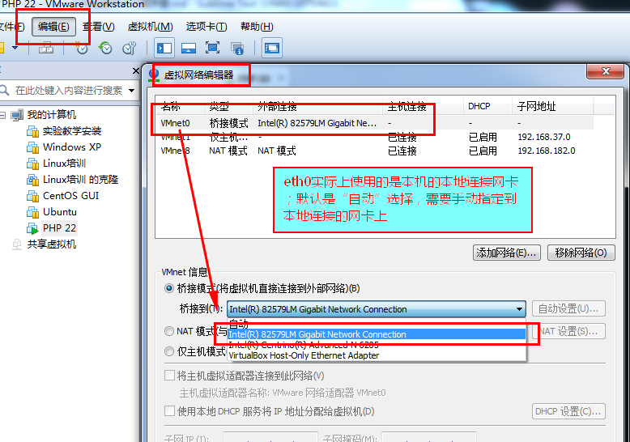

# 远程连接网卡设置步骤
2017/1/5 23:20:23 by 波哥

	一、 虚拟机中网卡设置
	二、 Linux网卡配置命令：setup
	三、 修改网卡配置文件，ONBOOT设置为yes，重启网卡
	四、 本机中用CMD检查是否可以ping通Linux主机
	五、 远程SSH连接工具Xshell连接

## 一、 虚拟机中网卡设置 ##

<table width="100%">
	<tr>
		<th>1. 网络连接选择“桥接模式”</th>
	</tr>
	<tr>
		<td class="center"></td>
	</tr>
	<tr>
		<th>2. 编辑 > 虚拟网络编辑器，</th>
	</tr>
	<tr>
		<td class="center"></td>
	</tr>
</table>

## 二、 Linux网卡配置命令：setup

<table width="100%">
	<tr>
		<th>3. 输入CentOS专有的命令：setup，选择网络配置：Network Config</th>
	</tr>
	<tr>
		<td class="center"></td>
	</tr>
	<tr>
		<th>4. 选择：Device Configuration</th>
	</tr>
	<tr>
		<td class="center"></td>
	</tr>
	<tr>
		<th>5. 选择eth0</th>
	</tr>
	<tr>
		<td class="center"></td>
	</tr>
	<tr>
		<th>6. 配置IP信息</th>
	</tr>
	<tr>
		<td class="center"></td>
	</tr>
</table>

## 三、 修改网卡配置文件，ONBOOT设置为yes，重启网卡

<table width="100%">
	<tr>
		<th>7. VIM编辑器打开网络配置文件</th>
	</tr>
	<tr>
		<td class="center"></td>
	</tr>
	<tr>
		<th>8. 修改ONBOOT为yes</th>
	</tr>
	<tr>
		<td class="center"></td>
	</tr>
	<tr>
		<th class="red">9. 重启网卡命令：service network restart（也可以重启Linux服务器）</th>
	</tr>
	<tr>
		<td class="center"></td>
	</tr>
	<tr>
		<th>10. 命令：ifconfig eth0 192.168.32.200可以设置“临时IP地址”</th>
	</tr>
	<tr>
		<td class="center"></td>
	</tr>
</table>

## 四、 本机中用CMD检查是否可以ping通Linux主机
<table width="100%">
	<tr>
		<th>ping命令</th>
	</tr>
	<tr>
		<td class="center"></td>
	</tr>
</table>

## 五、 远程SSH连接工具Xshell连接
<table width="100%">
	<tr>
		<th>SSH连接</th>
	</tr>
	<tr>
		<td class="center"></td>
	</tr>
</table>